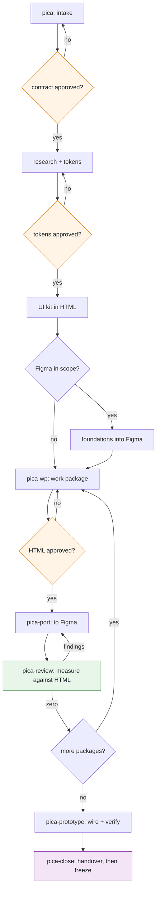

<div align="center">

# pica

**A design workflow for Claude Code.**

Prototype in HTML. Port to Figma on approval. Verify by measurement, never by eye.

[](https://github.com/vqdungwork/pica/releases)
[](LICENSE)
[](https://claude.com/claude-code)
[](#requirements)

</div>

---

> A **pica** is the unit designers have measured type in for six centuries.
> The name is the whole argument: work is checked against a measurement, not against an impression.

---

## The problem

Your design looks right. It is not right.

A hero sitting 47px low across three screens. A primary button hugging its label when it should fill
the width. Inputs holding a stale fixed height, quietly clipping their own error messages. A
component library with fifteen emoji standing in for icons. Forty-one text nodes bound to no font at
all, on the one page the client is actually scoring.

Every one of those passed visual review. Every one was obvious to a measurement.

Meanwhile the expensive medium gets built before anyone approved the cheap one, reviews and fixes
collapse into the same pass so nothing is auditable, and the file gets declared clean by comparing it
against itself.

`pica` fixes the order of operations and refuses to trust the eye.

## Install

```bash
/plugin marketplace add vqdungwork/pica
/plugin install pica@pica
```

Restart Claude Code. The workflow announces itself at the start of every session from then on,
including after a context compaction. You never have to remember to load it.

## The flow



The amber diamonds are **your** gates. Nothing crosses one without you.

| # | Step | Command | Runs |
|:--|:--|:--|:--|
| 0 | Workflow loads itself | none | Every session, automatically |
| 1 | Intake | `/pica` | Once per project |
| 2 | Research and tokens | inside step 1 | Once per project |
| 3 | UI kit in HTML | inside step 1 | Once per project |
| 4 | Foundations into Figma | inside step 1 | Only if Figma is in scope |
| 5 | Work package | `/pica-wp <name>` | Once per package |
| 6 | Port to Figma | `/pica-port <wp>` | Per package, **after approval** |
| 7 | Review | `/pica-review [wp]` | After every port |
| 8 | Prototype | `/pica-prototype` | Once, after screens land |
| 9 | Closeout | `/pica-close` | Once, at handover |

---

## The steps in detail

<details>
<summary><b>Step 0. The workflow loads itself</b></summary>

<br>

A `SessionStart` hook injects the non-negotiables into every session, and re-injects them after a
context compaction.

That last part matters more than it sounds. On the project this came from, a rule agreed on day one
had decayed by day two inside one long session, and had to be demanded again. Rules that live only in
prose get forgotten. These do not.

Six lines, always present:

1. HTML is the source of truth when HTML and Figma disagree.
2. Never port to Figma without approval for that specific work package.
3. Reviews report before they fix.
4. Never modify a delivered artefact.
5. Self-review before handing anything back.
6. For design work, run `/pica`.

</details>

<details>
<summary><b>Step 1. Intake</b>: the brief becomes a contract</summary>

<br>

`/pica` refuses to start without five things:

| Input | Why it is required |
|:--|:--|
| The brief, raw and unedited | Paraphrasing loses the exact wording that later settles disputes |
| Sources, each labelled `use` or `ignore` | An unlabelled folder once held several old versions of the same app, any of which could pass for current |
| The commercial constraint | Hours, cap, fixed-scope or time-and-materials, and anything the client must not be told |
| Environment facts | Which fonts are installed, which tools are live, what only you can do |
| One declaration | Is Figma a deliverable on this project |

You get back:

- a **contract**, one section per work package, each with acceptance criteria in your own terms
- an **exclusions list**, everything the brief rules out, quoted
- **two or three delivery options**, costed in one comparable table
- a **complexity tier** per package, for you to confirm

> **The exclusions list is the highest-value artefact in the whole flow.** On the source project a
> screen the brief explicitly ruled out got designed anyway. It was caught two days later, and only
> because a human happened to re-read the brief.

Nothing proceeds until you approve all four.

</details>

<details>
<summary><b>Step 2. Research and tokens</b>: evidence before invention</summary>

<br>

Audit before designing. Every source you labelled `use`, plus any adjacent source the brief implies:
if the brief says reuse an existing design system, the audit covers where that system actually lives,
not only the artefact being redesigned.

Tokens come out with **provenance recorded per token**: which source it came from, and whether it was
taken directly or derived.

If the brief claims an existing design system and no accessible source for it exists, you get told
that plainly, rather than getting an invention presented to you as reuse.

Output: `tokens.json` and `tokens.css`, one source feeding both the HTML and the Figma sides.

</details>

<details>
<summary><b>Step 3. UI kit in HTML</b>: the system, reviewable on its own</summary>

<br>

A storybook page showing every token and every component with all its variants and states. Single
file, no build step, opens in a browser.

Plus the review shell: **one tabbed page**. You never open a folder of separate HTML files. Each work
package adds a tab as it lands.

From here on, every screen consumes kit components. A one-off built inline on a screen is a review
finding, not a shortcut.

</details>

<details>
<summary><b>Step 4. Foundations into Figma</b>: skipped entirely if Figma is out of scope</summary>

<br>

Variables first, in two layers: primitives, then semantic aliases. Scopes set explicitly on every
variable, because the default pollutes every property picker in the file.

Text styles stitched from variables rather than literal values, with **font weight as a numeric
variable**. Swap a typeface later and the hierarchy cannot collapse.

Then the global components, the ones reused across screens.

Every created name is asserted against what was intended, because unknown style names and undefined
variables **do not throw**. They resolve to nothing, and the file still looks plausible.

</details>

<details>
<summary><b>Step 5. Work package</b>: with a harder road for the hard ones</summary>

<br>

Packages are tiered at intake. A package is **complex** if any of these hold:

- no precedent for it exists in the product being redesigned
- it changes navigation or information architecture
- no reference design exists to work from
- it embodies a decision the client will challenge

**Complex packages** take the long road: re-read the requirement, research precedent and cite it,
build two or three genuinely different options, then run a panel of four agents, each blind to the
others.

| Lens | Asks |
|:--|:--|
| Usability | Task walkthrough. Where does a user stall |
| Platform and accessibility | Conventions, contrast, touch targets, focus order |
| Product and business | Does this serve the goal. What does being wrong cost |
| Developer feasibility | Can the backend actually deliver this |

You get the options plus the panel's findings, **including where the lenses disagree**. Then you
choose.

> On the source project the feasibility lens found fifteen backend gaps and several false claims of
> component reuse. Nothing else would have surfaced them.

**Both tiers** then build: state matrix first, every screen and every state. Real assets, no emoji
standing in for icons. Screens taller than the viewport come as a **pair**, one fixed-viewport version
that really scrolls with pinned chrome, and one full-height version. Never a separate "scrolled"
duplicate frame.

Then a self-review, then your approval. Your approval is what unlocks step 6, and it is recorded to
disk.

</details>

<details>
<summary><b>Step 6. Port to Figma</b>: blocked at the tool level until approved</summary>

<br>

Not discouraged. **Blocked.** The write is denied if the package's HTML is not approved.

> On the source project a package was ported early and the entire page had to be deleted.

The port captures a measured reference from the HTML first: true text-run rectangles, every element
box, computed font size and weight, with the font forced to whatever Figma resolves so the diff
isolates layout from typeface metrics.

Then local components, composing globals rather than duplicating them. Then screens built from
instances only. Every frame auto layout, no spacer frames. HUG for content height, FILL for widths,
FIXED only for literal sizes.

A **circle sweep** runs every time. Radios, checkboxes, avatars, icon buttons, rings must be fixed on
both axes. Anything full-radius with unequal width and height is restored to the intended size, never
the collapsed one. This was the single most common defect class on the source project.

Then diff against the captured reference, fix, re-diff, repeat until every check returns zero.

**HTML is the source of truth. Where Figma and HTML disagree, Figma is wrong.**

</details>

<details>
<summary><b>Step 7. Review</b>: report first, fix second, never both at once</summary>

<br>

Two modes. **Report is the default and changes nothing.** Fixing requires `--fix`.

> That default exists because an audit once ran as a write against a delivered file and deleted a node
> unrecoverably.

While a report-mode review is running, every Figma write is denied.

Seven check families, all measured:

1. **Geometry against the HTML reference**, per frame, position and size
2. **Text bindings**: every node resolving to a style, every style to variables, and **unbound nodes
   reported explicitly**, because asking "is anything the wrong value" is structurally blind to nodes
   with no binding at all
3. **Layout**: circles, FILL versus HUG, shadows clipped by the wrong container, zero-size nodes,
   overlaps
4. **Contrast** for every text-on-background pair, including text over images and scrims
5. **Touch targets** against platform minimums, noting where the drawn box is deliberately smaller
6. **Reuse decay**: detached instances, inline duplication, locals duplicating a global
7. **Prototype**: dead ends, wrong targets, states with no way in or out

Reviews run **per package, immediately after its port**. Never saved for the end.

> Deferred once, review became 64 findings across 12 rounds, because two days of divergence had piled
> up.

</details>

<details>
<summary><b>Step 8. Prototype</b>: behaviour, not just links</summary>

<br>

Flow wiring plus component interactions: screen to screen, overlays as overlays, variant switching
for pressed, disabled, open and closed states. Each flow gets a walkthrough note saying what to watch
for.

Its own review loop then checks behaviour: dead ends, links to the wrong target, missing back paths,
states with no way in or out, and interactions the screens imply but the prototype does not offer.
Repeat until it comes back empty.

Motion is out of scope for 0.1.0, and the flow says so rather than improvising it.

</details>

<details>
<summary><b>Step 9. Closeout</b>: then the file freezes</summary>

<br>

**Re-read the original brief cold.** Not the contract, not the plan. Both are copies, and copies
drift.

Then:

- a **required-versus-present table**: every deliverable the brief names, against what exists and
  where, with gaps stated rather than quietly omitted
- the **handoff page**: platform deltas, naming conventions, the reuse map, and the open questions
  ordered by how badly they block
- the **design rationale**, because a brief that scores product thinking is scoring exactly this
- the **effort report**, within whatever the disclosure policy allows

Then a freeze. Every artefact becomes read-only and further writes are denied.

</details>

---

## What is enforced, and how

Three layers, with honest reliability. This package assumes model judgement is unreliable and is built
accordingly.

| Layer | Fires | Bypassable |
|:--|:--|:--|
| `SessionStart` hook | Always, including after compaction | **No** |
| Commands | When you type them, deterministic after that | Yes, by not typing them |
| `PreToolUse` hooks | On every matching tool call | **No** |

Four things are enforced by hook rather than by instruction, because instructions decay:

- no Figma write for a package whose HTML is not approved
- no Figma write while a report-mode review is running
- no Figma write after delivery
- no Figma write before the Figma API rules are loaded

Approvals live in `.pica/state.json` in your project. A hook is a shell script; it cannot know you
said yes out loud.

## Requirements

| Tier | Needs | Gives you |
|:--|:--|:--|
| **Core** | `bash` and `python3`, for the hooks | Steps 1, 2, 3, 5, 7 (HTML side), 9 |
| **Figma** | the Figma MCP server | Steps 4, 6, 7 (Figma side), 8 |
| **Measured diff** | playwright | The HTML capture harness that step 6 diffs against |
| **Enhanced** | [superpowers](https://github.com/obra/superpowers) | Stronger intake and planning, plus the agent panel |

**The core tier works with nothing else installed.** If you never touch Figma, the whole HTML flow
still runs, and the Figma steps say clearly that they are unavailable rather than failing halfway
through.

## The rules

Five modules, each written to be read on its own.

| Module | Covers |
|:--|:--|
| `research.md` | Research before designing, audit breadth, token extraction with provenance |
| `html-prototype.md` | Frame size, the single tabbed review page, the interactive and full-height pair, real assets, state matrices |
| `figma-elements.md` | Two token layers, explicit scopes, numeric font weights, styles stitched from variables, global versus local component tiers |
| `figma-screens.md` | Frames, states, FILL versus HUG, the circle rule, alignment measured against HTML, and the Plugin API calls that fail silently |
| `review-gates.md` | The self-review checklist, report versus fix, complexity criteria, panel lenses, and what "zero" means |

## Where this came from

This was extracted from **one** real client design pilot: a fixed-scope mobile app redesign delivered
against a 24 hour cap. Every rule in it earns its place from a specific failure on that project.

That is its strength and its limit. One project is not evidence that this generalises, and you will
hit cases it has never seen.

The HTML half is the better tested half. The Figma rules work, but they have been exercised against a
single design system in a single file. Hence `0.1.0`, and not `1.0`.

## Not included

Motion design and transition specs. Generating production code from designs. Exporting tokens into a
codebase. Any Figma community plugin. Desktop or web variants, since this is mobile-shaped for now.

## Contributing

Issues and pull requests welcome, particularly from anyone who runs this on a project it was not built
for. That is the evidence it currently lacks.

## Attribution

The `SessionStart` injection pattern is adapted from
[superpowers](https://github.com/obra/superpowers) by Jesse Vincent, MIT licensed.

## Licence

[MIT](LICENSE)

<div align="center">
<br>
<sub>Designers have measured for six centuries. Keep measuring.</sub>
</div>
