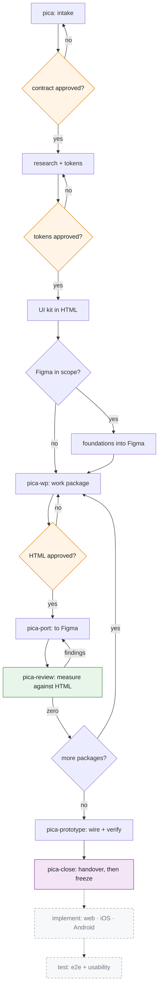

<div align="center">


**From a brief to a released product, checked by measurement at every step. For Claude Code.**

[](https://github.com/vqdungwork/pica/releases)
[](#what-is-enforced-and-how)
[](LICENSE)
[](https://claude.com/claude-code)
[](#requirements)

</div>

---

> A **pica** is the unit designers have measured type in for six centuries.
> The name is the whole argument: work is checked against a measurement, not against an impression.

---

## Contents

[What it does](#what-it-does) · [The problem](#the-problem) · [What you get](#what-you-get) ·
[How it works](#how-it-works) · [Just ask for it](#just-ask-for-it) · [Install](#install) ·
[The flow](#the-flow) · [In practice](#what-this-looks-like-in-practice) ·
[The steps in detail](#the-steps-in-detail) · [What is enforced](#what-is-enforced-and-how) ·
[Requirements](#requirements) · [The rules](#the-rules) · [Philosophy](#philosophy) ·
[Community](#community)

## What it does

You give it a brief. It gives you back a clickable, measured product — and it argues with you at every
step where a person would otherwise guess.

| | |
|:--|:--|
| **Understands the work** | Elicits the problem, the AS-IS and the TO-BE, the business rules and the use cases, and writes a PRD a non-technical client can actually read |
| **Knows the field** | 28 sectors of stakeholders, colour conventions and their reasons, the design tradition each settled on, and what each treats as a defect regardless of the brief |
| **Designs in HTML first** | At every viewport you declare, in every state, consuming a kit built before any screen. Cheap to change, cheap to measure, and it clicks |
| **Measures before it shows you** | Geometry, contrast, coverage, parity, the words, the wiring. **86 checks that fail closed** |
| **Has it reviewed** | Three to five independent evaluators, each with a different lens, none seeing another's findings, plus a cognitive walkthrough per use case |
| **Prices it honestly** | Three-point effort per role — but only after **scope and deadline are frozen**, because an estimate before that prices a guess and the guess becomes the commitment |
| **Holds the build to it** | Tests traced to use cases, a real pipeline, three environments, and the built product measured back against the design you approved |
| **Ports to Figma, if you want it** | Verified frame by frame against the HTML. Where the two disagree, Figma is wrong |

**What it will not do is write your code.** Writing code is the most mature thing in this ecosystem and a
worse version of it here would help nobody. pica never wrote a browser, it wrote the checks. It never
wrote Figma, it wrote the gates. **A coding agent executes; this decides whether what came out is
finished.**

## The problem

**Your design looks right. It is not right.**

A hero sitting 47px low across three screens. A primary button hugging its label when it should fill the
width. Inputs holding a stale fixed height, quietly clipping their own error messages. A component
library with fifteen emoji standing in for icons. Forty-one text nodes bound to no font at all, on the
one page the client is actually scoring.

Every one of those passed visual review. Every one was obvious to a measurement.

**Then there is the half a measurement does not catch either.**

> An error message at **2.15:1** contrast — less than half the legal floor — on the one line a person
> most needs to read, on the worst screen in the product.
>
> A requirement everyone agreed to that has **no screen at all**, beside a screen serving no requirement,
> in a file where every frame is tagged, in bounds, paired and covered.
>
> An education product built like an accounting console. Tokens correct, geometry clean, and a teacher
> knows in one second that nobody involved has watched a classroom.

None of those is a rendering defect. Each is a product that measures clean and is still wrong, and each
one here was found by a check written the day after it happened.

Meanwhile the expensive medium gets built before anyone approved the cheap one, review and fix collapse
into one pass so nothing is auditable, an estimate goes out before scope is frozen, and the file gets
declared clean by comparing it against itself.

**`pica` fixes the order of operations, refuses to trust the eye, and refuses to trust a check nobody has
watched fail.**

## What you get

<table>
<tr>
<td width="33%" valign="top">

### 86 checks
Every one **fails closed**. An empty input, a missing file, a selector matching nothing: each says so out
loud rather than reporting a clean run over nothing.

</td>
<td width="33%" valign="top">

### 28 sectors
141 stakeholders, 98 sector defects, 22 hues that are already spent. **Fails closed on a sector it does
not know**, because passing an unknown one gives the least-supported project the quietest gate.

</td>
<td width="33%" valign="top">

### 11 packages
Each installs on its own and pulls only what it needs. Never touching Figma? You never see that half.

</td>
</tr>
</table>

**And a claim that can be checked rather than believed:** every one of those 86 criteria has been *seen
to fail* on the defect it was written for. That is the only reason a number that grew from 15 to 86 in
one release is worth anything.

It was verified on **90 projects** — 84 generated across the 28 sectors in three viewport shapes, plus 6
built by hand through the entire lifecycle — with every runnable check on all of them, including the
implementation gate against **84 real git repositories**. Then **45 deliberate defects** were run past
every check at once, demanding both halves: the defect is caught, **and no other check fires**. Plus 6
legitimate changes that must pass clean, because a suite that only tests one direction cannot see a check
that cries wolf.

## How it works

It starts the moment you ask for design work. Instead of opening a file and drawing, it asks what you are
actually building — and it refuses to start until it has the brief in your words, your sources labelled
as ones to use or ignore, the commercial constraint, and one decision: **is Figma a deliverable here, or
not.**

**What comes back first is a contract, not a mockup.** One section per work package with acceptance
criteria, an exclusions list quoting everything the brief rules out, two or three costed options, and a
complexity tier for each. Nothing proceeds until you approve it.

Before a single screen exists it resolves the **sector**, and that decides more than a palette: education
runs three densities in one product because a learner, a teacher and a parent are not one audience;
red in a hospital means clinical emergency and cannot be spent on a delete button; blue on a food menu
reads as spoilage. Conventions are recorded **with the reason**, because a convention without one gets
overridden by the next person who finds it inconvenient.

Then it designs — **in HTML, at every viewport you declared** — because HTML is cheap to change, cheap to
measure, and real: it reflows, it scrolls, you can click it. Screens consume a kit built first, so a
one-off control invented mid-screen is a review finding rather than a shortcut.

**Before it shows you anything, it measures.** Overflow behind a frame edge. Contrast, computed rather
than sampled, composited through translucency. Screens taller than their viewport with no full-height
twin. Drift between viewports. A requirement with no screen, or a screen with no requirement. Copy that
says what broke and not what to do. Dead links and unreachable screens. **Every check returns zero or it
fixes and runs them again** — then it renders every frame and looks, because measurement and eyes catch
different defects.

Only then does it ask you to approve. And only after you approve does anything reach Figma — **enforced
by a hook, not by good intentions**. The port is verified back against the HTML frame by frame, and where
the two disagree the HTML wins.

If Figma is not in scope you stop after approval with a fully verified HTML design. That is a complete
pica project, not a truncated one.

**And if the client says yes, the flow keeps going.** Scope and deadline get frozen first. Then
three-point effort per role, a work order derived from the deadline with the arithmetic shown, C4
diagrams and decision records where every choice carries its downside, and non-functional requirements
stated as numbers with a way to measure each. Then the build: tests traced to use cases, a pipeline that
runs what a human should not be reviewing, short-lived branches, three environments deploying from main,
and finally **the comparison the industry reliably leaves undone** — the built product measured against
the design you approved, by the same harness, so the two cannot disagree about what was captured.

At closeout the real hours are logged back against the estimate, with a reason on any variance over 20
per cent. Without that the next estimate learns nothing and stays a guess forever.

## Just ask for it

The workflow announces itself at the start of every session, including after a compaction. You never have
to remember to load it. Talk normally:

```
Design the onboarding screens for our mobile app

Build a landing page for the new pricing tier

Design this dashboard for desktop and mobile

Port the approved HTML to Figma

Here is the brief. Run the whole thing and show me a review page
```

That last one is **`/picaflow`**, and it is the one worth knowing about. It runs from a thin brief to a
clickable `review.html` **without stopping to ask**, turning every gap into a labelled assumption
carrying a confidence and a blast radius.

That is not a shortcut, it is the argument. Reacting to a built thing is far cheaper than specifying one
from nothing: ask a client what their business flow is and you get hesitation; show them a wrong one that
clicks and you get the correction in three seconds. **The demo is the question. It is only packaged as an
answer.** What makes it safe is the assumptions register and nothing else.

### Where the line is

| pica is for | pica is not for |
|:--|:--|
| Applications — web, mobile, desktop | Illustration, images, photography |
| Websites and landing pages | Video, motion pieces, animation |
| Dashboards, admin tools, internal products | Logos, brand marks, identity work |
| Design systems and component libraries | Presentation decks and documents |
| The PRD, use cases and domain model behind them | Diagrams, charts, CLI and terminal output |
| Deciding whether the build matches the design | Writing the implementation code itself |

**pica designs things people navigate and someone has to build.** If nothing will be implemented from the
output, this is the wrong tool and it will get in your way: every gate it enforces exists to protect an
implementation that would otherwise be built from an unverified design.

It works on **any project, for anyone**. Nothing assumes a particular client, stack, brand or team. You
declare the viewports, whether Figma is in scope, and what the brief actually says. The flow adapts to
that and refuses to invent the rest.

## Install

```bash
/plugin marketplace add vqdungwork/pica
/plugin install pica@pica
```

That installs the bundle: all ten packages. Each also installs on its own with only what it needs, so
a team that only wants the business analysis takes `pica-analyst` and gets `pica-core` with it, and a
project that will never touch Figma takes `pica-html` and never sees the Figma half.
Restart Claude Code. The workflow announces itself at the start of every session from then on,
including after a context compaction. You never have to remember to load it.

**Or install only what the project needs.** pica is ten independently installable packages. Every one
declares `pica-core` as a dependency and pulls it in automatically, so any single install brings the
state schema and the gates with it:

```bash
/plugin install pica-core@pica       # required by everything below: intake, state, every gate
/plugin install pica-analyst@pica    # elicitation, domain and industry knowledge, use cases, the PRD
/plugin install pica-research@pica   # the source audit, the nine foundations, token provenance
/plugin install pica-html@pica       # work packages in HTML, and the measured gate
/plugin install pica-content@pica    # the words, in every state, bound to the glossary
/plugin install pica-designqa@pica   # independent evaluators, and the build against the design
/plugin install pica-architect@pica  # feasibility, C4, ADRs, NFRs as numbers
/plugin install pica-estimate@pica   # three-point effort, the work order, the effort record
/plugin install pica-impl@pica       # the definition of done for building and releasing
/plugin install pica-figma@pica      # the port, annotations, and the geometry diff
```

The dependency chain, which the installer resolves for you:

| Install this | You end up with | Because |
|:--|:--|:--|
| `pica-analyst` | 2 plugins | analysis needs the state schema and nothing else |
| `pica-architect`, `pica-estimate`, `pica-research` | 2 plugins each | the same |
| `pica-html` | 3 plugins | it needs `tokens/tokens.css`, which only research produces |
| `pica-content`, `pica-designqa`, `pica-figma` | 4 plugins each | all three read the capture artefact html produces |
| `pica-impl` | 5 plugins | 7.10 is Design QA's comparison, not the builder's, so impl pulls designqa too |
| `pica` | 11 plugins | the bundle |

Those counts are measured, not derived: each was installed on its own into a clean configuration and the
resolved set counted.

A project that will never touch Figma installs anything except `pica-figma` and never sees that half.
Run `node packages/core/scripts/pica-status.mjs` in a project to see which packages are ready and what
each blocked one is waiting for.

## The flow



The amber diamonds are **your** gates. Nothing crosses one without you.

The dashed boxes have since **half landed**, and the half that has not is deliberate.

`pica-impl` now ships the **definition of done** for building, reviewing, testing and releasing, plus
`impl-check` (test trace, CI, branch protection, branch age, environments, secrets, NFR measured, stack
declared) and `build-diff`, which compares the built product against the approved design. That last one
is the check the industry reliably leaves undone: the designer assumes QA covers it and QA assumes the
designer does.

**What it does not ship is a coding agent, and it should not.** Writing code is the most mature thing
in this ecosystem; rebuilding it here would mean a worse version of the tool this runs on top of. pica
never wrote a browser, it wrote the checks. It never wrote Figma, it wrote the gates. It does not write
React either. **A coding agent executes; this decides whether what came out is finished.**

The contracts in `packages/_planned/` stay, because the interface is still worth agreeing before the
work starts.

| # | Step | Command | Runs |
|:--|:--|:--|:--|
| — | Workflow loads itself | none | Every session, automatically |
| — | **The whole chain, unattended** | `/picaflow <brief>` | Brief in, `review.html` out |
| 0 | Intake: brief verbatim, sources labelled, **data requested** | `/pica` | Once per project |
| 1 | Research: analytics, support logs, journey map, **3 to 5 shipped products measured** | inside `/pica` | Once per project |
| 1.8 | **Feasibility, before anything is promised** | `/pica-architect --feasibility` | Once, early |
| 2 | Domain knowledge, **industry knowledge**, glossary, AS-IS, TO-BE, the delta, use cases, **PRD** | `/pica-analyse` | Once per project |
| 3.1–3.3 | Design direction, tokens in three tiers, UI kit | inside `/pica` | Once per project |
| 3.4 | Work package: every viewport, every state, the interactive flow | `/pica-wp <name>` | Once per package |
| 3.5 | **The words**, every state, bound to the glossary | `/pica-copy` | Per package |
| 3.7 | **Measure.** All checks zero, or fix and re-run | inside `/pica-wp` | Per package |
| 3.8–3.9 | **3 to 5 independent evaluators**, then a walkthrough per use case | `/pica-evaluate` | Per package |
| 3.10 | Render every frame and **look at it**, then click the main flow | inside `/pica-wp` | Per package |
| 4 | **Client approves.** Account freezes scope and deadline | human | The gate that matters |
| 5 | **Three-point effort by role**, work order from the deadline | `/pica-estimate` | After the client says yes |
| 6 | C4 diagrams, ADRs, NFRs as numbers | `/pica-architect` | After the contract |
| 7 | Build, test, release, **compare the build against the approved design** at 7.10 | `/pica-build` | After the contract |
| 7f | Port to Figma for the developers, verify, wire the prototype | `/pica-port`, `/pica-review`, `/pica-prototype` | Only if Figma is a deliverable |
| 8 | Closeout, then **log the real hours back** | `/pica-close`, `/pica-estimate --closeout` | Once, at handover |
| — | Feedback triage | `/pica-feedback` | Any time someone else's review lands, before or after delivery |

**These are the ids the rules and scripts use.** A rule that says "step 7.10" and a table that called the
same work "step 12" is a flow nobody can follow across two documents, and this table carried its own
sequence through three releases before anyone tried to trace one to the other.

## What this looks like in practice

Before you are asked to approve anything, the HTML is measured. This is the gate:

```
$ node verify-html.mjs .audit/html-reference.json .pica/state.json

frames captured:     33 across 2 package(s)
viewports declared:  desktop 1440x900, mobile 375x812
frames per viewport: desktop=12, mobile=21

pass  viewport-tagged      0 finding(s)   (33 frames checked)
pass  overflow             0 finding(s)   (33 frames checked)
pass  tall-screen-pair     0 finding(s)   (8 frames exceed their viewport by >24px)
pass  viewport-coverage    0 finding(s)   (2 viewports declared)
pass  direction            0 finding(s)   (direction "International, Material elevation",
                                           5 assertion(s), style "international" checked
                                           against its signature)
pass  data-ownership       0 finding(s)   (1 read-only region)
pass  width-media          0 finding(s)   (0 width @media rules)

0 finding(s). HTML passes the measured gate.
```

**A package cannot start before its inputs exist.** Ask to port to Figma too early and you get told
exactly what is missing, rather than a half-built file:

```
$ /pica-port search

BLOCKED  figma
         missing gate      htmlApproved:search
         missing artifact  .audit/html-reference.json

Run /pica-wp search and get HTML approval first.
```

**And every check fails closed.** Point one at a directory that matches nothing and it refuses to write
an artefact rather than reporting a clean run over zero files:

```
FAIL  captured 0 frames from 3 file(s).
      wrap selector  --sel   ".frame-wrap"
      frame selector --frame "[data-viewport]"
      One of these matches nothing. Nothing was written: an empty
      reference would pass every downstream check while measuring nothing.
```

That last one is the whole argument in six lines. A check that reports success for work it did not do is
worse than no check, because its silence reads as a pass.

**The sector gate is the one people do not expect.** It resolves the field, then checks the design
against what that field already decided:

```
$ node industry-check.mjs .pica/state.json

field:  primary school classroom learning and gradebook
sector: education — Education and learning, from schools to training
        5 stakeholders known, 3 sector defects, 5 exemplars

pass  industry-known     0 finding(s)   (resolved to education)
FAIL  stakeholders       1 finding(s)   (3 deciding)
FAIL  conventions        1 finding(s)   (5 axes)

FINDING  [stakeholders] parent or guardian
         this sector's "parent or guardian" can decide or veto and appears in no register.
         They fear: finding out about a problem too late. Design consequence: the parent
         view is a third density, and it must translate rather than expose the teacher's terms

FINDING  [conventions] colour
         no decision recorded on colour. The sector's convention is: warm and optimistic,
         a trustworthy blue or green base with a warm accent. Follow it with a note, or
         depart from it with a reason, but do not leave it undecided
```

Nothing there is a rendering defect. It is a product that would have measured clean and been wrong, and
the check tells you **why the sector cares**, not just that a box is empty.

**And the one that is legally binding.** Contrast is computed from the resolved colours, composited
through translucency, never sampled from a screenshot:

```
$ node contrast-check.mjs .audit/html-reference.json .pica/state.json

runs measured: 60
level:         AA (4.5:1 normal, 3.0:1 large)

FAIL  body-contrast     1 finding(s)   (60 runs)

FINDING  [body-contrast] screens :: Today · error · mobile :: "Could not save that check-in"
         2.15:1 at 16px/400, and AA needs 4.5:1 for normal text.
         rgb(245, 158, 11) on rgb(255, 255, 255)
```

That is a real finding from the first project this check ever ran against: the error message, at less
than half the required ratio, on the worst screen in the product. It looked fine.

Text over an image, a gradient or a translucent layer is reported as **unresolved**, never as clean. A
confident wrong ratio is worse than an admitted gap.

---

## The steps in detail

<details>
<summary><b>Step 0. The workflow loads itself</b></summary>

<br>

A `SessionStart` hook injects the non-negotiables into every session, and re-injects them after a
context compaction.

That last part matters more than it sounds. On the project this came from, a rule agreed on day one
had decayed by day two inside one long session, and had to be demanded again. Rules that live only in
prose get forgotten. These do not.

Six lines, always present:

1. HTML is the source of truth when HTML and Figma disagree.
2. Never port to Figma without approval for that specific work package.
3. Reviews report before they fix.
4. Never modify a delivered artefact.
5. Self-review before handing anything back.
6. For design work, run `/pica`.

</details>

<details>
<summary><b>Step 1. Intake</b>: the brief becomes a contract</summary>

<br>

`/pica` refuses to start without five things:

| Input | Why it is required |
|:--|:--|
| The brief, raw and unedited | Paraphrasing loses the exact wording that later settles disputes |
| Sources, each labelled `use` or `ignore` | An unlabelled folder once held several old versions of the same app, any of which could pass for current |
| The commercial constraint | Hours, cap, fixed-scope or time-and-materials, and anything the client must not be told |
| Environment facts | Which fonts are installed, which tools are live, what only you can do |
| One declaration | Is Figma a deliverable on this project |

You get back:

- a **contract**, one section per work package, each with acceptance criteria in your own terms
- an **exclusions list**, everything the brief rules out, quoted
- **two or three delivery options**, costed in one comparable table
- a **complexity tier** per package, for you to confirm

> **The exclusions list is the highest-value artefact in the whole flow.** On the source project a
> screen the brief explicitly ruled out got designed anyway. It was caught two days later, and only
> because a human happened to re-read the brief.

Nothing proceeds until you approve all four.

</details>

<details>
<summary><b>Step 2. Research, direction and tokens</b>: evidence before invention</summary>

<br>

Audit before designing. Every source you labelled `use`, plus any adjacent source the brief implies:
if the brief says reuse an existing design system, the audit covers where that system actually lives,
not only the artefact being redesigned.

Tokens come out with **provenance recorded per token**: which source it came from, and whether it was
taken directly or derived.

If the brief claims an existing design system and no accessible source for it exists, you get told
that plainly, rather than getting an invention presented to you as reuse.

Between the audit and the tokens sits the **design direction**: the house style the product's field
already expects, which a brief almost never states. You name the field narrowly at intake — "retail
banking dashboard", not "fintech" — and pica proposes two or three named directions derived from three
to five real products in that field **that it measured**: radius, control height, how many hues the
interface actually spends, whether figures are tabular. You pick one, the same way you pick a costed
option at step 1.

pica ships **no table** of what a field looks like. A canned "banking means small radii" is a preference
with a confident tone; it cannot be defended in a client review and it is wrong the moment a field
moves. What ships is the method. A precedent with no measurement is not a precedent.

Where a brand already exists the direction is *your own system*, scored against what its field does, and
the gaps come back as questions rather than corrections. Your brand still wins; each gap you accept is
recorded with its reason.

The direction is written as **numbers**, not prose, and `verify-html` holds every package to them — so
the direction chosen in week one is still in force at package eleven, which is the only part of this
that is hard.

Output: `tokens.json` and `tokens.css`, one source feeding both the HTML and the Figma sides.

</details>

<details>
<summary><b>Step 3. UI kit in HTML</b>: the system, reviewable on its own</summary>

<br>

A storybook page showing every token and every component with all its variants and states. Single
file, no build step, opens in a browser.

Plus the review shell: **one tabbed page**. You never open a folder of separate HTML files. Each work
package adds a tab as it lands.

From here on, every screen consumes kit components. A one-off built inline on a screen is a review
finding, not a shortcut.

</details>

<details>
<summary><b>Step 4. Foundations into Figma</b>: skipped entirely if Figma is out of scope</summary>

<br>

Variables first, in two layers: primitives, then semantic aliases. Scopes set explicitly on every
variable, because the default pollutes every property picker in the file.

The primitives are `Colors`, `Spacing`, `Radius`, **`Border`** and `Typography`. `Border` is the one
people forget, and its absence is not a small gap: with no `STROKE_FLOAT` scale there is nothing to bind a
border width to, so every stroke in the file stays a raw number and a client reviewing token coverage
finds it immediately.

Any translucent surface gets its **own** token carrying the alpha — `scrim`, `overlay/pill`,
`overlay/control`. Binding a paint's colour makes the variable's RGBA authoritative and **overwrites the
paint's opacity**, so alpha held as a manual opacity on a bound paint does not survive.

Text styles stitched from variables rather than literal values, with **font weight as a numeric
variable**. Swap a typeface later and the hierarchy cannot collapse.

Then the global components, the ones reused across screens.

Every created name is asserted against what was intended, because unknown style names and undefined
variables **do not throw**. They resolve to nothing, and the file still looks plausible.

</details>

<details>
<summary><b>Step 5. Work package</b>: with a harder road for the hard ones</summary>

<br>

Packages are tiered at intake. A package is **complex** if any of these hold:

- no precedent for it exists in the product being redesigned
- it changes navigation or information architecture
- no reference design exists to work from
- it embodies a decision the client will challenge

**Complex packages** take the long road: re-read the requirement, research precedent and cite it,
build two or three genuinely different options, then run a panel of four agents, each blind to the
others.

| Lens | Asks |
|:--|:--|
| Usability | Task walkthrough. Where does a user stall |
| Platform and accessibility | Conventions, contrast, touch targets, focus order |
| Product and business | Does this serve the goal. What does being wrong cost |
| Developer feasibility | Can the backend actually deliver this |

You get the options plus the panel's findings, **including where the lenses disagree**. Then you
choose.

> On the source project the feasibility lens found fifteen backend gaps and several false claims of
> component reuse. Nothing else would have surfaced them.

**Both tiers** then build: state matrix first, every screen and every state. Real assets, no emoji
standing in for icons. Screens taller than the viewport come as a **pair**, one fixed-viewport version
that really scrolls with pinned chrome, and one full-height version. Never a separate "scrolled"
duplicate frame.

**And the flow, interactively.** Options settle a decision and then become provenance; the deliverable is
something you click, one prototype per application, linked to the others for real. `flow-check.mjs` proves
every link resolves, every screen is reachable and nothing is a dead end. Whether a link goes somewhere
*sensible* is what your click is for, and on the source project that is where every routing defect was
found.

Then the measured checks, then rendering every screen and looking at it, then a self-review, then your
approval. Your approval is what unlocks the next package, and it is recorded to disk.

</details>

<details>
<summary><b>Step 6. Port to Figma</b>: blocked at the tool level until approved</summary>

<br>

Not discouraged. **Blocked.** The write is denied if the package's HTML is not approved.

> On the source project a package was ported early and the entire page had to be deleted.

The port captures a measured reference from the HTML first: true text-run rectangles, every element
box, computed font size and weight, with the font forced to whatever Figma resolves so the diff
isolates layout from typeface metrics.

Then local components, composing globals rather than duplicating them. Then screens built from
instances only. Every frame auto layout, no spacer frames. HUG for content height, FILL for widths,
FIXED only for literal sizes.

A **circle sweep** runs every time. Radios, checkboxes, avatars, icon buttons, rings must be fixed on
both axes. Anything full-radius with unequal width and height is restored to the intended size, never
the collapsed one. This was the single most common defect class on the source project.

Then diff against the captured reference, fix, re-diff, repeat until every check returns zero.

**HTML is the source of truth. Where Figma and HTML disagree, Figma is wrong.**

</details>

<details>
<summary><b>Step 7. Review</b>: report first, fix second, never both at once</summary>

<br>

Two modes. **Report is the default and changes nothing.** Fixing requires `--fix`.

> That default exists because an audit once ran as a write against a delivered file and deleted a node
> unrecoverably.

While a report-mode review is running, every Figma write is denied.

Ten check families, all measured:

1. **Geometry against the HTML reference**, per frame, position and size
2. **Text bindings**: every node resolving to a style, every style to variables, and **unbound nodes
   reported explicitly**, because asking "is anything the wrong value" is structurally blind to nodes
   with no binding at all
3. **Layout**: circles, FILL versus HUG, shadows clipped by the wrong container, zero-size nodes,
   overlaps
4. **Contrast** for every text-on-background pair, including text over images and scrims
5. **Touch targets** against platform minimums, noting where the drawn box is deliberately smaller
6. **Reuse decay**: detached instances, inline duplication, locals duplicating a global
7. **Prototype**: dead ends, wrong targets, states with no way in or out
8. **Hygiene**: placeholders, banned characters, home indicators, and every published number recounted
9. **Geometry token binding**: all four corner radii individually, all four padding sides, border width,
   and every fill and stroke matched on **RGBA** — with anything raw needing a registered reason
10. **Appearance preserved**: a binding that changes what a node renders is a defect, caught by diffing
    an appearance baseline rather than by counting bindings

That last one exists because the other nine can all pass on a file that renders wrongly. A token-binding
pass once bound ~2,000 properties, reported zero unbound on every page, and had silently flattened 38
translucent surfaces to opaque.

Reviews run **per package, immediately after its port**. Never saved for the end.

> Deferred once, review became 64 findings across 12 rounds, because two days of divergence had piled
> up.

</details>

<details>
<summary><b>Step 8. Prototype</b>: behaviour, not just links</summary>

<br>

Flow wiring plus component interactions: screen to screen, overlays as overlays, variant switching
for pressed, disabled, open and closed states. Each flow gets a walkthrough note saying what to watch
for.

Its own review loop then checks behaviour: dead ends, links to the wrong target, missing back paths,
states with no way in or out, and interactions the screens imply but the prototype does not offer.
Repeat until it comes back empty.

Motion is out of scope for 0.2.0, and the flow says so rather than improvising it.

Prototype pages hold **clones**, because Figma cannot link across pages. Component-level fixes reach them
automatically; frame-level fixes do not, so the review re-measures each clone against its source rather
than assuming they match.

</details>

<details>
<summary><b>Step 9. Closeout</b>: then the file freezes</summary>

<br>

**Re-read the original brief cold.** Not the contract, not the plan. Both are copies, and copies
drift.

Then:

- a **required-versus-present table**: every deliverable the brief names, against what exists and
  where, with gaps stated rather than quietly omitted
- the **handoff page**: platform deltas, naming conventions, the reuse map, and the open questions
  ordered by how badly they block
- the **design rationale**, because a brief that scores product thinking is scoring exactly this
- the **effort report**, within whatever the disclosure policy allows

Then a freeze. Every artefact becomes read-only and further writes are denied.

</details>

---

## What is enforced, and how

Three layers, with honest reliability. This package assumes model judgement is unreliable and is built
accordingly.

| Layer | Fires | Bypassable |
|:--|:--|:--|
| `SessionStart` hook | Always, including after compaction | **No** |
| Commands | When you type them, deterministic after that | Yes, by not typing them |
| `PreToolUse` hooks | On every matching tool call | **No** |

Four things are enforced by hook rather than by instruction, because instructions decay:

- no Figma write for a package whose HTML is not approved
- no Figma write while a report-mode review is running
- no Figma write after delivery
- no Figma write before the Figma API rules are loaded

Approvals live in `.pica/state.json` in your project. A hook is a shell script; it cannot know you
said yes out loud.

## Requirements

| Tier | Needs | Gives you |
|:--|:--|:--|
| **Core** | `bash` and `python3`, for the hooks | Everything up to an approved design, and everything after it except Figma |
| **Figma** | the Figma MCP server, plus a Dev or Full seat | Phase 7f only: the port, the geometry diff, the wired prototype |
| **Measured diff** | playwright | The capture harness every measured check reads, at 3.7 and 7.10 |
| **Enhanced** | [superpowers](https://github.com/obra/superpowers) | Stronger intake and planning, plus the agent panel |

**The core tier works with nothing else installed.** If you never touch Figma, the whole HTML flow
still runs, and the Figma steps say clearly that they are unavailable rather than failing halfway
through.

**The Figma tier needs enough MCP calls to finish.** The rate limits are real and they do not degrade
gracefully — they return a paywall message where you expected data, mid-task. A **View or Collab seat gets
6 calls per month**, which is not enough to port anything; Dev and Full seats get 200 to 600 per day. Run
`whoami`, which is exempt from the limits, and size the work to the budget before starting. See the figma
package's `figma-mcp.md`.

## The rules

Twenty modules across ten packages, each written to be read on its own and loaded only when a step
names it. That is why a repository of this size costs about 370 tokens per session: rules do not
auto-load, and a project without Figma never pays for the five Figma modules.

| Module | Package | Covers |
|:--|:--|:--|
| `research.md` | research | Research before designing, audit breadth, token extraction with provenance, mock-data provenance, the client's copy rules and data-ownership table |
| `design-vocabulary.md` | research | The nine foundations, typography as roles, named styles with measurable signatures, where to look and why Mobbin is not Dribbble |
| `business-analysis.md` | analyst | BABOK's four beats, AS-IS and TO-BE as two models, the glossary, numbered business rules, traceability |
| `industry-knowledge.md` | analyst | How to use the sector base at `packages/analyst/data/industries.json`, and `--audit` to check it against itself: 28 sectors with stakeholders, colour conventions **and the reason each reserved hue is reserved**, the tradition each sector settled on and the ones that misread in it, density per audience, typography, tone, and what the sector treats as a defect regardless of the brief. Read it with `industry-check.mjs --list` and `--show <sector>`. **Fails closed on a sector it does not cover**, because passing an unknown sector would give the least-supported projects the quietest gate |
| `domain-knowledge.md` | analyst | Where to find domain constraints in order of authority, Event Storming without a workshop, the eight questions every project answers |
| `content.md` | content | Terms from the glossary, length-realistic copy, every state written, mock data that is not quietly wrong |
| `evaluation.md` | designqa | Three to five independent evaluators, heuristic versus cognitive walkthrough, computed contrast, report before fix as a tool restriction |
| `architecture.md` | architect | Feasibility before promises, C4, ADRs with consequences, NFRs as numbers |
| `estimation.md` | estimate | Three-point PERT by role, the deadline as a control not information, the effort loop nobody closes |
| `implementation.md` | impl | One design and three viewports with targets choosing, trunk-based branching, pull requests, environments, the definition of done |
| `native-mobile.md` | html | Two guideline sets, safe areas as chrome, and the release asymmetry: Android can stage a rollout and iOS cannot |
| `html-prototype.md` | html | Frame size, the single tabbed review page, option boards versus the interactive main flow, navigation state, the interactive and full-height pair, real assets, state matrices |
| `html-gates.md` | html | The measured HTML gate, the flow gate, viewport parity, HTML-only coverage, behaviour review for prototypes |
| `figma-elements.md` | figma | Token layers including `Border`, binding geometry as well as type, alpha living in the token, numeric font weights, font-package forensics, global versus local component tiers |
| `figma-screens.md` | figma | Frames, states, FILL versus HUG, vertical centring, screen-chrome pinning, the circle rule, alignment measured against HTML, and the Plugin API calls that fail silently |
| `figma-mcp.md` | figma | Rate limits and the call budget, `page.loadAsync` for whole-file reads in one call, write discipline |
| `figma-gates.md` | figma | The Figma audit checklist, appearance baselines, geometry-diff tolerances, the deviations register |
| `figma-rebuild.md` | figma | Rebuilding a client's existing Figma file: the source as arbiter, the shared coordinate system, positional content parity, baselining every lens against the source |
| `reference-discipline.md` | core | Medium-independent: the reference is read-only and checkable, names are not identity, content parity as its own criterion, fix at the definition |
| `review-discipline.md` | core | The self-review checklist, report versus fix, complexity criteria, panel lenses, writing checks that can fail, audit integrity, and what "zero" means |

## What this repo contains

It ships the **method**: rules, commands, hooks and the eighty-six checks. It does **not** ship the projects the
rules were derived from. Those carry briefs, PRDs, real copy and client identifiers, and none of that is
yours to receive — so `spike/` is in `.gitignore` and stays on the author's disk.

That means the findings arrive as claims you cannot re-run, and you should read them that way. The durable
form of each one is in [CHANGELOG.md](CHANGELOG.md): a rule, and the specific failure that earned it. A
rule whose failure is not written down next to it is the kind of rule that gets deleted by the next person
who finds it inconvenient, which is why the changelog is long and why every entry names what broke.

**The eighty-six, so the number can be recounted rather than trusted:**

| Script | Checks | Runs |
|:--|--:|:--|
| `contrast-check.mjs` | 4 | body contrast, large-text contrast, unresolved background, exemption still needed |
| `verify-html.mjs` | 7 | viewport tagged, overflow, tall-screen pair, viewport coverage, direction (all eight assertions, the declared style against its signature, and any assertion nothing can evaluate), data ownership, width media |
| `parity-check.mjs` | 2 | nominal, structural — two or more viewports only |
| `flow-check.mjs` | 7 | dead end, dangling href, dangling target, unreachable, orphan prototype, nav target, flow declared |
| `coverage-check.mjs` | 5 | use case covered, screen traced, use case exists, flow reachable, target buildable |
| `geometry-diff.mjs` | 1 | Figma position against the HTML reference — Figma projects only |
| `scripts/validate-packages.mjs` | — | Not a check on a project, a check on **this repository**: every declared file exists, every shipped file is owned, every manifest matches the schema, and no markdown link crosses a package boundary. It lives at the repo root, outside `packages/`, which is how it stayed unrun through an entire audit |
| `mock-figma.mjs` | — | Not a check. Runs the three in-Figma scripts outside Figma, and self-tests them with `node mock-figma.mjs`. Without it those 800 lines could only be verified by pasting them into a paid Figma session against a real file |
| `trace-check.mjs` | 7 | glossary closure, rule enforcement, use case trace, entity terms, AS-IS present, assumption radius, exclusions asked |
| `schema-check.mjs` | 6 | sample size, nine foundations, type roles, provenance, shipped not concept, tradition named |
| `estimate-check.mjs` | 6 | preconditions, three points, tier spread, risk reflected, headcount, effort log |
| `copy-check.mjs` | 5 | no placeholder, glossary terms, copy rules, error next step, length realism |
| `code-tokens-check.mjs` | 4 | raw colour, raw spacing, raw radius, linear easing |
| `domain-check.mjs` | 5 | all categories, sourced, verified, agent claims surfaced, affects |
| `arch-check.mjs` | 7 | feasibility verdict, risk priced, NFR complete, constraint becomes NFR, ADR complete, technology has an ADR, mobile signing custody |
| `industry-check.mjs` | 7 | industry known, stakeholders, constraints, conventions, forbidden, style excluded, evidence |
| `impl-check.mjs` | 8 | test trace, CI pipeline, branch protection, branch age, environments, secrets, NFR measured, stack declared |
| `build-diff.mjs` | 5 | frame paired, control height, radius, hue budget, text position |
| | **86** | |

A check here is a **named criterion that fails closed**: it has a stated pass condition, it returns
non-zero when it is not met, and no step continues past it. The captures (`capture-html-reference.mjs`,
`capture-baseline.js`) are not checks — they produce the artefact the checks read. The Figma-side audit
scripts (`figma-audit.js`, `source-parity.js`) run inside the Plugin API and report through the review,
not through an exit code.

The count rose from 15 to 86 in one session, and every one of the seventy-one new criteria has been seen to fail on the defect it was written for. Counting scripts instead of criteria is what let this number drift: it read "seven" from 0.5.0 and
"eight" from 0.7.0 in two places that disagreed for three releases, because nobody could recount it.

To generate your own evidence, run the flow on a project of your own. The checks are self-contained: point
`capture-html-reference.mjs` at a directory of HTML, then run `verify-html.mjs` and `parity-check.mjs`
against the artefact and your `.pica/state.json`, and `flow-check.mjs` against the HTML directory itself. Each states its pass criterion, and each fails closed —
if it cannot do its job it exits non-zero rather than reporting a clean run.

Four projects is not proof that this generalises, and you will hit cases it has never seen. If you run
it on one it was not built for, the findings are the contribution worth having.

## Not included

Motion design and transition specs. Generating production code from designs. Exporting tokens into a
codebase. Any Figma community plugin. Responsive breakpoints as a continuum — the flow guarantees the
**declared** viewports and says nothing about the widths between them.

## Philosophy

- **Measure, do not eyeball** — every serious defect on the projects behind this passed visual review
- **The cheap medium first** — nothing expensive gets built before the cheap one is approved
- **Report before you fix** — finding and fixing are separate passes; an audit that writes is not an audit
- **A check must fail closed** — if it cannot do its job it exits non-zero, never a clean run over nothing
- **A green check is not evidence the check works** — make it fail on purpose before you trust it
- **Approval is a decision, not an inference** — silence, "looks ready" and moving on are not approval
- **Every rule names the failure that earned it** — a rule without one gets deleted by the next person
- **A rule with no register is a preference** — if something "must be written down" it needs a named key
  in state and something that reads it, or a deliberate exception is indistinguishable from an oversight
- **A check that cannot run is not a pass** — an empty input, a missing file, a selector matching nothing:
  each says so out loud rather than reporting clean
- **A false positive is worse than a miss** — a check that cries wolf gets switched off, and then it
  catches nothing at all
- **Measurement and review find different defects** — neither substitutes for the other, and ten green
  checks once coexisted with four screenshot-obvious defects

## Community

- **Issues and questions**: <https://github.com/vqdungwork/pica/issues>
- **Changelog**: [CHANGELOG.md](CHANGELOG.md) — every rule beside the failure that earned it
- **Design notes**: [`docs/specs/`](docs/specs) and [`docs/plans/`](docs/plans) — the reasoning behind
  the current structure, including what was decided against

## Contributing

Issues and pull requests welcome, particularly from anyone who runs this on a project it was not built
for. That is the evidence it currently lacks.

## Attribution

The `SessionStart` injection pattern is adapted from
[superpowers](https://github.com/obra/superpowers) by Jesse Vincent, MIT licensed.

## Licence

[MIT](LICENSE)

<div align="center">
<br>
<sub>Designers have measured for six centuries. Keep measuring.</sub>
</div>
