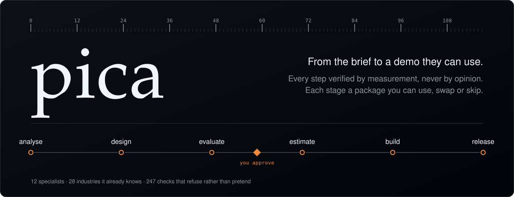
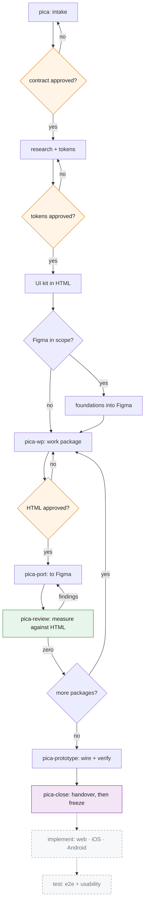

<div align="center">



**A design workflow for Claude Code.**

[](https://github.com/vqdungwork/pica/releases)
[](LICENSE)
[](https://claude.com/claude-code)
[](#requirements)

</div>

---

> A **pica** is the unit designers have measured type in for six centuries.
> The name is the whole argument: work is checked against a measurement, not against an impression.

---

## Contents

[The problem](#the-problem) · [What it is for](#what-it-is-for) · [How it works](#how-it-works) ·
[Install](#install) · [The flow](#the-flow) · [In practice](#what-this-looks-like-in-practice) ·
[The steps in detail](#the-steps-in-detail) · [What is enforced](#what-is-enforced-and-how) ·
[Requirements](#requirements) · [The rules](#the-rules) · [Philosophy](#philosophy) ·
[Community](#community)

## The problem

Your design looks right. It is not right.

A hero sitting 47px low across three screens. A primary button hugging its label when it should fill
the width. Inputs holding a stale fixed height, quietly clipping their own error messages. A
component library with fifteen emoji standing in for icons. Forty-one text nodes bound to no font at
all, on the one page the client is actually scoring.

Every one of those passed visual review. Every one was obvious to a measurement.

Meanwhile the expensive medium gets built before anyone approved the cheap one, reviews and fixes
collapse into the same pass so nothing is auditable, and the file gets declared clean by comparing it
against itself.

`pica` fixes the order of operations and refuses to trust the eye.

## What it is for

**Interfaces someone is going to build.** An application, a website, a landing page, a dashboard, a set
of screens, or the design system behind them. Say *"design the app"*, *"design this landing page"*,
*"design these screens"*, *"build a design system"*, *"port the HTML to Figma"* — and the flow starts.

| pica is for | pica is not for |
|:--|:--|
| Applications — web, mobile, desktop | Illustration, images, photography |
| Websites and landing pages | Video, motion pieces, animation |
| Dashboards, admin tools, internal products | Logos, brand marks, identity work |
| Design systems and component libraries | Presentation decks and documents |
| Screens that need a spec someone can implement | Diagrams, charts, CLI and terminal output |

The line is simple: **pica designs things people navigate and someone has to build.** If nothing will be
implemented from the output, this is the wrong tool and it will get in your way — every gate it enforces
exists to protect an implementation that would otherwise be built from an unverified design.

It also works on **any project, for anyone**. Nothing in it assumes a particular client, stack, brand or
team. You declare the viewports, whether Figma is in scope, and what the brief actually says; the flow
adapts to that and refuses to invent the rest.

### Just ask for it

The skill activates on its own. Talk normally:

```
Design the onboarding screens for our mobile app

Build a landing page for the new pricing tier

Design this dashboard for desktop and mobile

Port the approved HTML to Figma

Review the Figma file against the HTML
```

## How it works

It starts the moment you ask for design work. Instead of opening a file and drawing, it asks what
you are actually building — and it refuses to start until it has the brief in your words, your sources
labelled as ones to use or ignore, the commercial constraint, and one decision: **is Figma a deliverable
here, or not.**

What comes back first is a contract, not a mockup. One section per work package with acceptance
criteria, an exclusions list quoting everything the brief rules out, two or three costed options, and a
complexity tier for each package. Nothing proceeds until you approve it.

Then it designs — **in HTML, at every viewport you declared**, because HTML is cheap to change, cheap to
measure, and it is real: it reflows, it scrolls, you can click it. The screens consume a UI kit built
first, so a one-off control invented mid-screen is a review finding rather than a shortcut.

Before it shows you anything, it measures. Overflow behind a frame edge. Screens taller than their
viewport with no full-height twin. Drift between viewports, compared by counting elements rather than
listing them. Dead links and unreachable screens in the prototype. **Every check has to return zero, or
it fixes and runs them again** — and then it renders every frame and looks at them, because measurement
and eyes catch different defects.

Only then does it ask you to approve. And only after you approve does anything reach Figma — enforced by
a hook, not by good intentions. The port is verified back against the HTML by measurement, frame by
frame, and where the two disagree the HTML wins.

If Figma is not in scope, you stop after approval with a fully verified HTML design. That is a complete
pica project, not a truncated one.

## Install

```bash
/plugin marketplace add vqdungwork/pica
/plugin install pica@pica
```

That installs the bundle — all four packages, so an existing install keeps working unchanged.
Restart Claude Code. The workflow announces itself at the start of every session from then on,
including after a context compaction. You never have to remember to load it.

**Or install only what the project needs.** pica is four independently installable packages;
`pica-html`, `pica-research` and `pica-figma` each declare `pica-core` as a dependency and pull it
in automatically:

```bash
/plugin install pica-core@pica    # required by everything below
/plugin install pica-research@pica  # the source audit and token provenance
/plugin install pica-html@pica    # work packages in HTML, and the measured gate
/plugin install pica-figma@pica   # the port, annotations, and the geometry diff — needs pica-html
```

A project that will never touch Figma installs `pica-core`, `pica-research` and `pica-html`, and
never sees the Figma half. `pica-html` depends on both `pica-core` and `pica-research` — it needs
`tokens/tokens.css`, which only research produces — so installing it pulls both in. `pica-figma`
depends on `pica-core` and `pica-html`, so installing it pulls in the whole chain.

## The flow



The amber diamonds are **your** gates. Nothing crosses one without you.

The dashed boxes are **declared, not built** — `impl-web`, `impl-ios`, `impl-android` and `e2e` exist
as contracts in `packages/_planned/`, so the interface is agreed before the work starts. They are drawn
this way deliberately: a tool whose first rule is never to claim an unverified state cannot draw its
roadmap as though it were finished.

| # | Step | Command | Runs |
|:--|:--|:--|:--|
| 0 | Workflow loads itself | none | Every session, automatically |
| 1 | Intake | `/pica` | Once per project |
| 2 | Research and tokens | inside step 1 | Once per project |
| 3 | UI kit in HTML | inside step 1 | Once per project |
| 4 | Foundations into Figma | inside step 1 | Only if Figma is in scope |
| 5 | Work package | `/pica-wp <name>` | Once per package |
| 6 | Port to Figma | `/pica-port <wp>` | Per package, **after approval** |
| 7 | Review | `/pica-review [wp]` | After every port |
| 8 | Prototype | `/pica-prototype` | Once, after screens land |
| 9 | Closeout | `/pica-close` | Once, at handover |
| 10 | Implement — web, iOS, Android | *declared, not built* | Contract agreed in `packages/_planned/` |
| 11 | Test — e2e and usability | *declared, not built* | Contract agreed in `packages/_planned/` |
| — | Feedback triage | `/pica-feedback` | Any time someone else's review lands, before or after delivery |

## What this looks like in practice

Before you are asked to approve anything, the HTML is measured. This is the gate:

```
$ node verify-html.mjs .audit/html-reference.json .pica/state.json

frames captured:     33 across 2 package(s)
viewports declared:  desktop 1440x900, mobile 375x812
frames per viewport: desktop=12, mobile=21

pass  viewport-tagged      0 finding(s)   (33 frames checked)
pass  overflow             0 finding(s)   (33 frames checked)
pass  tall-screen-pair     0 finding(s)   (8 frames exceed their viewport by >24px)
pass  viewport-coverage    0 finding(s)   (2 viewports declared)

0 finding(s). HTML passes the measured gate.
```

**A package cannot start before its inputs exist.** Ask to port to Figma too early and you get told
exactly what is missing, rather than a half-built file:

```
$ /pica-port search

BLOCKED  figma
         missing gate      htmlApproved:search
         missing artifact  .audit/html-reference.json

Run /pica-wp search and get HTML approval first.
```

**And every check fails closed.** Point one at a directory that matches nothing and it refuses to write
an artefact rather than reporting a clean run over zero files:

```
FAIL  captured 0 frames from 3 file(s).
      wrap selector  --sel   ".frame-wrap"
      frame selector --frame "[data-viewport]"
      One of these matches nothing. Nothing was written: an empty
      reference would pass every downstream check while measuring nothing.
```

That last one is the whole argument in six lines. A check that reports success for work it did not do is
worse than no check, because its silence reads as a pass.

---

## The steps in detail

<details>
<summary><b>Step 0. The workflow loads itself</b></summary>

<br>

A `SessionStart` hook injects the non-negotiables into every session, and re-injects them after a
context compaction.

That last part matters more than it sounds. On the project this came from, a rule agreed on day one
had decayed by day two inside one long session, and had to be demanded again. Rules that live only in
prose get forgotten. These do not.

Six lines, always present:

1. HTML is the source of truth when HTML and Figma disagree.
2. Never port to Figma without approval for that specific work package.
3. Reviews report before they fix.
4. Never modify a delivered artefact.
5. Self-review before handing anything back.
6. For design work, run `/pica`.

</details>

<details>
<summary><b>Step 1. Intake</b>: the brief becomes a contract</summary>

<br>

`/pica` refuses to start without five things:

| Input | Why it is required |
|:--|:--|
| The brief, raw and unedited | Paraphrasing loses the exact wording that later settles disputes |
| Sources, each labelled `use` or `ignore` | An unlabelled folder once held several old versions of the same app, any of which could pass for current |
| The commercial constraint | Hours, cap, fixed-scope or time-and-materials, and anything the client must not be told |
| Environment facts | Which fonts are installed, which tools are live, what only you can do |
| One declaration | Is Figma a deliverable on this project |

You get back:

- a **contract**, one section per work package, each with acceptance criteria in your own terms
- an **exclusions list**, everything the brief rules out, quoted
- **two or three delivery options**, costed in one comparable table
- a **complexity tier** per package, for you to confirm

> **The exclusions list is the highest-value artefact in the whole flow.** On the source project a
> screen the brief explicitly ruled out got designed anyway. It was caught two days later, and only
> because a human happened to re-read the brief.

Nothing proceeds until you approve all four.

</details>

<details>
<summary><b>Step 2. Research and tokens</b>: evidence before invention</summary>

<br>

Audit before designing. Every source you labelled `use`, plus any adjacent source the brief implies:
if the brief says reuse an existing design system, the audit covers where that system actually lives,
not only the artefact being redesigned.

Tokens come out with **provenance recorded per token**: which source it came from, and whether it was
taken directly or derived.

If the brief claims an existing design system and no accessible source for it exists, you get told
that plainly, rather than getting an invention presented to you as reuse.

Output: `tokens.json` and `tokens.css`, one source feeding both the HTML and the Figma sides.

</details>

<details>
<summary><b>Step 3. UI kit in HTML</b>: the system, reviewable on its own</summary>

<br>

A storybook page showing every token and every component with all its variants and states. Single
file, no build step, opens in a browser.

Plus the review shell: **one tabbed page**. You never open a folder of separate HTML files. Each work
package adds a tab as it lands.

From here on, every screen consumes kit components. A one-off built inline on a screen is a review
finding, not a shortcut.

</details>

<details>
<summary><b>Step 4. Foundations into Figma</b>: skipped entirely if Figma is out of scope</summary>

<br>

Variables first, in two layers: primitives, then semantic aliases. Scopes set explicitly on every
variable, because the default pollutes every property picker in the file.

The primitives are `Colors`, `Spacing`, `Radius`, **`Border`** and `Typography`. `Border` is the one
people forget, and its absence is not a small gap: with no `STROKE_FLOAT` scale there is nothing to bind a
border width to, so every stroke in the file stays a raw number and a client reviewing token coverage
finds it immediately.

Any translucent surface gets its **own** token carrying the alpha — `scrim`, `overlay/pill`,
`overlay/control`. Binding a paint's colour makes the variable's RGBA authoritative and **overwrites the
paint's opacity**, so alpha held as a manual opacity on a bound paint does not survive.

Text styles stitched from variables rather than literal values, with **font weight as a numeric
variable**. Swap a typeface later and the hierarchy cannot collapse.

Then the global components, the ones reused across screens.

Every created name is asserted against what was intended, because unknown style names and undefined
variables **do not throw**. They resolve to nothing, and the file still looks plausible.

</details>

<details>
<summary><b>Step 5. Work package</b>: with a harder road for the hard ones</summary>

<br>

Packages are tiered at intake. A package is **complex** if any of these hold:

- no precedent for it exists in the product being redesigned
- it changes navigation or information architecture
- no reference design exists to work from
- it embodies a decision the client will challenge

**Complex packages** take the long road: re-read the requirement, research precedent and cite it,
build two or three genuinely different options, then run a panel of four agents, each blind to the
others.

| Lens | Asks |
|:--|:--|
| Usability | Task walkthrough. Where does a user stall |
| Platform and accessibility | Conventions, contrast, touch targets, focus order |
| Product and business | Does this serve the goal. What does being wrong cost |
| Developer feasibility | Can the backend actually deliver this |

You get the options plus the panel's findings, **including where the lenses disagree**. Then you
choose.

> On the source project the feasibility lens found fifteen backend gaps and several false claims of
> component reuse. Nothing else would have surfaced them.

**Both tiers** then build: state matrix first, every screen and every state. Real assets, no emoji
standing in for icons. Screens taller than the viewport come as a **pair**, one fixed-viewport version
that really scrolls with pinned chrome, and one full-height version. Never a separate "scrolled"
duplicate frame.

**And the flow, interactively.** Options settle a decision and then become provenance; the deliverable is
something you click, one prototype per application, linked to the others for real. `flow-check.mjs` proves
every link resolves, every screen is reachable and nothing is a dead end. Whether a link goes somewhere
*sensible* is what your click is for, and on the source project that is where every routing defect was
found.

Then the measured checks, then rendering every screen and looking at it, then a self-review, then your
approval. Your approval is what unlocks step 6, and it is recorded to disk.

</details>

<details>
<summary><b>Step 6. Port to Figma</b>: blocked at the tool level until approved</summary>

<br>

Not discouraged. **Blocked.** The write is denied if the package's HTML is not approved.

> On the source project a package was ported early and the entire page had to be deleted.

The port captures a measured reference from the HTML first: true text-run rectangles, every element
box, computed font size and weight, with the font forced to whatever Figma resolves so the diff
isolates layout from typeface metrics.

Then local components, composing globals rather than duplicating them. Then screens built from
instances only. Every frame auto layout, no spacer frames. HUG for content height, FILL for widths,
FIXED only for literal sizes.

A **circle sweep** runs every time. Radios, checkboxes, avatars, icon buttons, rings must be fixed on
both axes. Anything full-radius with unequal width and height is restored to the intended size, never
the collapsed one. This was the single most common defect class on the source project.

Then diff against the captured reference, fix, re-diff, repeat until every check returns zero.

**HTML is the source of truth. Where Figma and HTML disagree, Figma is wrong.**

</details>

<details>
<summary><b>Step 7. Review</b>: report first, fix second, never both at once</summary>

<br>

Two modes. **Report is the default and changes nothing.** Fixing requires `--fix`.

> That default exists because an audit once ran as a write against a delivered file and deleted a node
> unrecoverably.

While a report-mode review is running, every Figma write is denied.

Ten check families, all measured:

1. **Geometry against the HTML reference**, per frame, position and size
2. **Text bindings**: every node resolving to a style, every style to variables, and **unbound nodes
   reported explicitly**, because asking "is anything the wrong value" is structurally blind to nodes
   with no binding at all
3. **Layout**: circles, FILL versus HUG, shadows clipped by the wrong container, zero-size nodes,
   overlaps
4. **Contrast** for every text-on-background pair, including text over images and scrims
5. **Touch targets** against platform minimums, noting where the drawn box is deliberately smaller
6. **Reuse decay**: detached instances, inline duplication, locals duplicating a global
7. **Prototype**: dead ends, wrong targets, states with no way in or out
8. **Hygiene**: placeholders, banned characters, home indicators, and every published number recounted
9. **Geometry token binding**: all four corner radii individually, all four padding sides, border width,
   and every fill and stroke matched on **RGBA** — with anything raw needing a registered reason
10. **Appearance preserved**: a binding that changes what a node renders is a defect, caught by diffing
    an appearance baseline rather than by counting bindings

That last one exists because the other nine can all pass on a file that renders wrongly. A token-binding
pass once bound ~2,000 properties, reported zero unbound on every page, and had silently flattened 38
translucent surfaces to opaque.

Reviews run **per package, immediately after its port**. Never saved for the end.

> Deferred once, review became 64 findings across 12 rounds, because two days of divergence had piled
> up.

</details>

<details>
<summary><b>Step 8. Prototype</b>: behaviour, not just links</summary>

<br>

Flow wiring plus component interactions: screen to screen, overlays as overlays, variant switching
for pressed, disabled, open and closed states. Each flow gets a walkthrough note saying what to watch
for.

Its own review loop then checks behaviour: dead ends, links to the wrong target, missing back paths,
states with no way in or out, and interactions the screens imply but the prototype does not offer.
Repeat until it comes back empty.

Motion is out of scope for 0.2.0, and the flow says so rather than improvising it.

Prototype pages hold **clones**, because Figma cannot link across pages. Component-level fixes reach them
automatically; frame-level fixes do not, so the review re-measures each clone against its source rather
than assuming they match.

</details>

<details>
<summary><b>Step 9. Closeout</b>: then the file freezes</summary>

<br>

**Re-read the original brief cold.** Not the contract, not the plan. Both are copies, and copies
drift.

Then:

- a **required-versus-present table**: every deliverable the brief names, against what exists and
  where, with gaps stated rather than quietly omitted
- the **handoff page**: platform deltas, naming conventions, the reuse map, and the open questions
  ordered by how badly they block
- the **design rationale**, because a brief that scores product thinking is scoring exactly this
- the **effort report**, within whatever the disclosure policy allows

Then a freeze. Every artefact becomes read-only and further writes are denied.

</details>

---

## What is enforced, and how

Three layers, with honest reliability. This package assumes model judgement is unreliable and is built
accordingly.

| Layer | Fires | Bypassable |
|:--|:--|:--|
| `SessionStart` hook | Always, including after compaction | **No** |
| Commands | When you type them, deterministic after that | Yes, by not typing them |
| `PreToolUse` hooks | On every matching tool call | **No** |

Four things are enforced by hook rather than by instruction, because instructions decay:

- no Figma write for a package whose HTML is not approved
- no Figma write while a report-mode review is running
- no Figma write after delivery
- no Figma write before the Figma API rules are loaded

Approvals live in `.pica/state.json` in your project. A hook is a shell script; it cannot know you
said yes out loud.

## Requirements

| Tier | Needs | Gives you |
|:--|:--|:--|
| **Core** | `bash` and `python3`, for the hooks | Steps 1, 2, 3, 5, 7 (HTML side), 9 |
| **Figma** | the Figma MCP server, plus a Dev or Full seat | Steps 4, 6, 7 (Figma side), 8 |
| **Measured diff** | playwright | The HTML capture harness that step 6 diffs against |
| **Enhanced** | [superpowers](https://github.com/obra/superpowers) | Stronger intake and planning, plus the agent panel |

**The core tier works with nothing else installed.** If you never touch Figma, the whole HTML flow
still runs, and the Figma steps say clearly that they are unavailable rather than failing halfway
through.

**The Figma tier needs enough MCP calls to finish.** The rate limits are real and they do not degrade
gracefully — they return a paywall message where you expected data, mid-task. A **View or Collab seat gets
6 calls per month**, which is not enough to port anything; Dev and Full seats get 200 to 600 per day. Run
`whoami`, which is exempt from the limits, and size the work to the budget before starting. See the figma
package's `figma-mcp.md`.

## The rules

Eight modules, split across the four packages, each written to be read on its own.

| Module | Package | Covers |
|:--|:--|:--|
| `research.md` | research | Research before designing, audit breadth, token extraction with provenance, mock-data provenance, the client's copy rules and data-ownership table |
| `html-prototype.md` | html | Frame size, the single tabbed review page, option boards versus the interactive main flow, navigation state, the interactive and full-height pair, real assets, state matrices |
| `html-gates.md` | html | The measured HTML gate, the flow gate, viewport parity, HTML-only coverage, behaviour review for prototypes |
| `figma-elements.md` | figma | Token layers including `Border`, binding geometry as well as type, alpha living in the token, numeric font weights, font-package forensics, global versus local component tiers |
| `figma-screens.md` | figma | Frames, states, FILL versus HUG, vertical centring, screen-chrome pinning, the circle rule, alignment measured against HTML, and the Plugin API calls that fail silently |
| `figma-mcp.md` | figma | Rate limits and the call budget, `page.loadAsync` for whole-file reads in one call, write discipline |
| `figma-gates.md` | figma | The Figma audit checklist, appearance baselines, geometry-diff tolerances, the deviations register |
| `figma-rebuild.md` | figma | Rebuilding a client's existing Figma file: the source as arbiter, the shared coordinate system, positional content parity, baselining every lens against the source |
| `review-discipline.md` | core | The self-review checklist, report versus fix, complexity criteria, panel lenses, writing checks that can fail, audit integrity, and what "zero" means |

## What this repo contains

It ships the **method**: rules, commands, hooks and the seven checks. It does **not** ship the projects the
rules were derived from. Those carry briefs, PRDs, real copy and client identifiers, and none of that is
yours to receive — so `spike/` is in `.gitignore` and stays on the author's disk.

That means the findings arrive as claims you cannot re-run, and you should read them that way. The durable
form of each one is in [CHANGELOG.md](CHANGELOG.md): a rule, and the specific failure that earned it. A
rule whose failure is not written down next to it is the kind of rule that gets deleted by the next person
who finds it inconvenient, which is why the changelog is long and why every entry names what broke.

To generate your own evidence, run the flow on a project of your own. The checks are self-contained: point
`capture-html-reference.mjs` at a directory of HTML, then run `verify-html.mjs` and `parity-check.mjs`
against the artefact and your `.pica/state.json`, and `flow-check.mjs` against the HTML directory itself. Each states its pass criterion, and each fails closed —
if it cannot do its job it exits non-zero rather than reporting a clean run.

Four projects is not proof that this generalises, and you will hit cases it has never seen. If you run
it on one it was not built for, the findings are the contribution worth having.

## Not included

Motion design and transition specs. Generating production code from designs. Exporting tokens into a
codebase. Any Figma community plugin. Responsive breakpoints as a continuum — the flow guarantees the
**declared** viewports and says nothing about the widths between them.

## Philosophy

- **Measure, do not eyeball** — every serious defect on the projects behind this passed visual review
- **The cheap medium first** — nothing expensive gets built before the cheap one is approved
- **Report before you fix** — finding and fixing are separate passes; an audit that writes is not an audit
- **A check must fail closed** — if it cannot do its job it exits non-zero, never a clean run over nothing
- **A green check is not evidence the check works** — make it fail on purpose before you trust it
- **Approval is a decision, not an inference** — silence, "looks ready" and moving on are not approval
- **Every rule names the failure that earned it** — a rule without one gets deleted by the next person

## Community

- **Issues and questions**: <https://github.com/vqdungwork/pica/issues>
- **Changelog**: [CHANGELOG.md](CHANGELOG.md) — every rule beside the failure that earned it
- **Design notes**: [`docs/specs/`](docs/specs) and [`docs/plans/`](docs/plans) — the reasoning behind
  the current structure, including what was decided against

## Contributing

Issues and pull requests welcome, particularly from anyone who runs this on a project it was not built
for. That is the evidence it currently lacks.

## Attribution

The `SessionStart` injection pattern is adapted from
[superpowers](https://github.com/obra/superpowers) by Jesse Vincent, MIT licensed.

## Licence

[MIT](LICENSE)

<div align="center">
<br>
<sub>Designers have measured for six centuries. Keep measuring.</sub>
</div>
